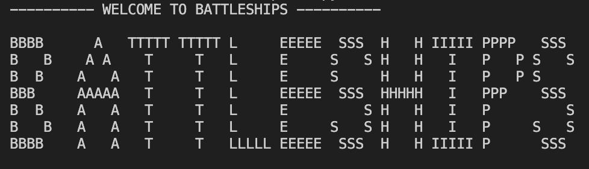

# BattleShips
## Code Institute Learner Project 03

## Intro

Battleship is a classic naval strategy game. This project version is a text-based interpretation implemented in Python, where players attempt to sink a fleet of enemy ships before running out of available shots.

The player chooses the board size, then chooses how many ships they have to find. The computer then calculates and places the ships on the board and provides the user with a calculated amount of shots to make the game fair yet balanced. 

Legend:
1. "." Empty space or water
2. "#" Water thats been hit, a miss as the space isn't part of a ship
3. "X" Part of a ship has been hit
4. "0" Part of a ship, this isn't seen by the player. However, it can be accessed in debug mode and it will locate all the ships on the board.

# Table of Contents
1. [Introduction](#intro)
2. [How to Play](#how-to-play)
    * [Rules](#rules)
    * [Game Set Up](#game-set-up)
    * [Playing the Game](#playing-the-game)
    * [How to Win](#how-to-win)
3. [Features](#features)
4. [Planning Phase](#planning-phase)
    * [User Stories](#user-stories)
    * [Site Aims](#site-aims)
    * [How This Is Achieved](#how-this-is-achieved)
    * [Game Play Flow chart](#game-play-flow-chart)
5. [Data Model](#data-model)
    * [Overview of Functions](#overview-of-functions)
    * [Logic Flow](#logic-flow)
6. [Testing Phase](#testing-phase)
    * [Manual Testing](#manual-testing)
    * [Bugs and Fixes](#bugs-and-fixes)
    * [Post Development Testing](#post-development-testing)
7. [Technologies Used](#technologies-used)
8. [Deployment](#deployment)
9. [Credits](#credits)

## How to Play
### Rules
This is a 1 player game where the user plays against the computer to find all computer generated ships on the board before they run out of shots.
### Game Set Up
1. The user chooses the board size.
    * This can be between 5 and 20
    * The board will be a square grid based on the users input. (e.g 5x5)
2. The User Chooses the amount of ships they have to find.
    * The program calculates whether the amount of ships will fit on 20% of the board
    * if the number they pick is out of range the program will ask them to pick between specific numbers
3. The amount of shots is calculated
    * The program calculates the amount of shots the user has based on how big the board is and how many shots they have chosen.

### Playing the Game
* Once the player has customised the game to their liking they will be prompted to pick a space on the grid.
* Provided the user makes a valid move, the board will then show one of two options:
    * '#' - This indicates they have hit empty water, a message is also displayed to indicate that their shot missed.
    * 'X' - This indicates that part of a ship has been hit. There will also be a confirmation message which says either:
        * "Bullseye! A ship has been shot" if only part of a ship has been shot
        * "Bullseye! You sunk my battleship!" if the whole ship has now been hit
* At the end of the game the users is given the oportinity to play again. Should they choose to play again the board resets and allows them to change the size and the amount of ships again.

### How to Win
To win the game you have to hit all the ships before you run out of bullets. Messages display in the terminal whether you win or loose:

## Features
#### Customisable Board Size

The user is able to choose their own board size between a 5x5 and 20x20 grid to give a wide array of size options which makes every time you play the game feel unique.
#### Variable Number of Ships
The user is able to decide how challenging their game is by choosing how many ships there are. There are some background calculations to make sure the board isn't overcrowded and that all the ships will be able to fit on the board without hanging off the edges.
#### Dynamic Shot Calculation

The amount of shots that the user is given is automatically generated based on the amount of ships they have chosen and the size of the board.
#### Intuiative UI
  
The board is easily laid out and the shots are clearly displayed so the user knows whether they have hit or missed a ship. there are also text prompts after every shot to tell the user the outcome of their shot.
The game utilizes ascii art to signify whether the player wins or looses. Examples of this can be seen in the *How to Win* section above.
#### Reveal Ships
If you loose the game, the board is printed again but this time with the remaining ships on it. This allows the user to see how close their guesses were and how close to winning the may have been.
#### Play Again Option
At the end of the game, the user is given the option to play again. If they pick yes then the board and ship locations reset and the code effectively restarts allowing them to choose a new board size and amount of ships they have to hit. This gives variety to the game and allows the user to customise each new instance of the game.

## Planning Phase

### User Stories
During the market research stage of this project, potential users asked the following:
* A user would like the ability to change the size of the board to make it either easier or more of a challenge as they don't often see this in a terminal based game.
* Users wanted the ability to change the amount of ships they have to find as this will give them a customised experience and change the difficulty.
* Users want a dinamic experience and the ability to play again at the end of the game. They said a lot of terminal games do not give the option to play again or personalise each game.
* A user pointed out that they should be able to see the locations of any remaining ships at the end of the game, so they can see how close they were to winning. 
### Site Aims
* The site aims to give the user the chance to play a customizable version of the classic battleships game on the browser window or a terminal with no other software required. 
* It aims to allow the user to play on a size board they choose and a difficulty level they can pick with no coding or programing experience.
### How This is Achieved
This is achieved in the following ways:
* Deploying the game using Heroku allows for a terminal experience within the browser window without the need to install software such as an IDE.
* Allowing the user to customize there experience with resizable boards and amount of ships, as well as being able to reset the board and number of ships for each game.
### Game Play Flow Chart

## Data Model

### Overview of Functions
The game is made up of 10 core functions which work together to make main game work. A brief overview of these functions is as follows:

* **Setup_Game** - This function takes input from the user to determine the grid size, amount of ships they want to find and based of their choices, calculates the amount of shots the user gets.
* **Make_board** - This function takes the results of the user input and runs the calculations to make the board as well as calculating the ship size and direction then asigns their locations.
* **Print_Board** - Once all the calculations have been made, the board is then printed to the terminal with this function.
* **Attempt_Ship_Placement** - This function calculates the placement of the ships based on their randomly generated size and attempts to place them on the board. These will be hidden from the user.
* **Valid_Bullet** - This function takes in the users input for making the shot, calculates whether the input is valid i.e a single letter followed by a 1 or 2 digit number depending on the size of the board. If the input doesn't meet the requirements an error message is displayed to the user.
* **Make_Shot** - Once all the calculations have been made, this function is responsible for displaying the shot on the board and working out whether a ship has been hit.
* **Ship_Sunk** - This function is determines whether all parts of a ship have been shot, if they have it displays the message to the user and the number of ships remaining drops by one.
* **Is_Game_Over** - This function runs to check to see if the game is still going and calculates whether the user wins or looses the game then displays the output based on the calculations.
* **Reveal_Ships** - This function runs at the end of the game if the user looses, it is responsible for displaying the locations of the remaining ships on the board.
* **Main** - The main function is the most important as it controls the order of all the functions and determins the glow of the game.
### Logic Flow

## Testing Phase
I have spent weeks going through this code, googling solutions, consulting AI and playing the game more times than I care to admit, just to make sure it works as expected.
### Manual Testing
Wnen creating this game I tested every function thoroughly to make sure it was performing how I expected. I have played the game thousands of times at this point, trying to find errors in the code and ways to broke the game. 

For every new feature, such as changing the board size, I tested how this would appear and made sure corectly and that everything lined up in the rows and columns. 

I tested with invalid input methods to see what the outcomes would be and this allowed me to adjust my code to prevent these inputs from causing issues.

I also built in a debug mode to the code so if needed I can show all the ship locations and where the function is trying to print them incase there are any issues.
### Bugs and Fixes
Bugs that I came across during the development and testing of this project include: 

**Number Alignment**

During the majority of testing phase, the grid wasn't properly aligned. The Alphabet was aligning with the dots correctly, however the numbers (originally positioned at the bottom of the grid) were off-centred and it didn't give a good experience for the player.

I fixed this by positioning the numbers at the top of the board and providing more space between each number to align single digits with the dots and the first character of double digets to the dots as well.
    
**Invalid Inputs** 

There bugs with every section that required user inputs as initially there was no failsafe if the program encountered unnexpected imputs. Each input bug is as follows:

**Board Size**

Initially there was no way to change the board size and it was fixed as 10x10. This worked but the function that makes the board was originally taking values between 0-9 as the range of columns started on 0. This was eventually fixed as I changed the range between 1-10. 

Another issue arose when making the size of the ship customizable. I made the error to not limit the size of the board, the original code made it max out at 80x80 and it could go as small as 1x1 while still trying to place the desired amount of ships on the board. 

I fixed the size to only accept values between 5 and 20, this gave the user customisability without it being too easy or far too dificult. It also made it more likely that the ships would fit on the board.

**Ship Placement**

Having the ships randomly generated and sized caused a number of issues in the development of the game.
* The ships were originally randomly sized between 2 and 3 spaces long, if the board was too large these were near impossible to find, if the board was too small there was a risk of these overlapping and crashing the code. 
* The code has to calculate the 

### Post Development Testing
Once I was happy with my code and that the game functioned as intended I then tested my code in the Code Institute Python linter. This showed that allot of my code was too long to fit on the lines so I had to work out ways of reducing line lengths.

For the most part this was just in print statements which I simply put in tripple quotes to allow multi-line statements. there were a few lines of code where I had to work out how to apply multiple lines to them or shink them. For these I utilised Stack Overflow as well as ChatGPT.

The result can be seen below.

As you can see, it still claims to have a few issues, all of these are actually the make up of the win and loose messages.
## Technologies Used
This project is solely made in the popular programing languge Python3 and it has been built using Visual Studio Code and a GitHub repository. The project is deployed with Heroku.
## Deployment

## Credits
### Honerable Mentions
* My Code Institute mentor Richard Wells has been a great help during this project as well as teaching me a lot about how python programs should run.
* My Class Mates on Slack
* Useful articles on stack overflow

### References
* The base for my project was a Tutorial by Jarvis Silva [Battleships tutorial](https://pythondex.com/python-battleship-game?utm_content=cmp-true)
* ChatGPT has been helpful with parts of the code
### Media
The Win and Loose messages were generated with ascii art at [patorjk.com](https://patorjk.com/software/taag/#p=display&f=Graffiti&t=Type%20Something%20)